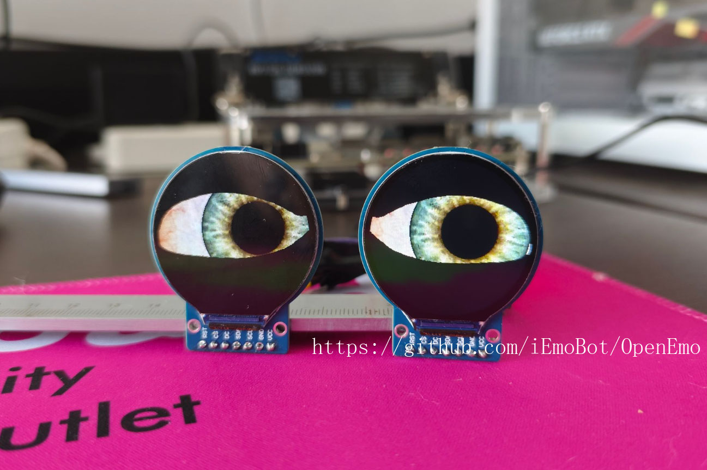

OpenEmo is an open-source emotion recognition project, whose core lies in emotion recognition through multimodal perception. By deeply fusing three types of modal data (video, audio, and text), this project achieves accurate recognition and analysis of human emotional states, providing developers, researchers, and enterprises with directly reusable multimodal emotion computing tools.

## Core Features

* **Multimodal model-driven recognition capability**: With multimodal emotion models as the core, it supports single-modal or multimodal joint input of video, audio, and text, and improves the robustness of emotion recognition through the model's cross-modal correlation learning

* **Fine-grained emotional dimension coverage**: Not only supports classification of 6 basic emotions such as joy, anger, and sadness, but also can output emotional intensity, 

* **End-to-end analysis pipeline**: Built-in complete pipeline from data preprocessing to emotion output, supporting direct acquisition of emotion analysis results from raw modal data

## Sub Projects
**ESP32S3 displays double eye expressions on dual circular 240x240 1.8-inch GC9A01 SPI displays
Using ESP32-S3 development board, connect the circular 240x240 1.8-inch GC9A01 SPI display, and use Arduino tft-eSPI library to display double eyes expression:

## Technical Characteristics

* **Multimodal fusion architecture**: Adopts dual-branch attention mechanism and cross-modal feature alignment technology to solve the heterogeneity problem of different modal data, making the model more tolerant to noisy data

* **Modular model design**: The core model is divided into three independently replaceable modules: modal feature encoder, cross-modal fusion device, and emotion decoder, facilitating researchers to carry out algorithm improvement and innovation

* **Engineering deployment support**: Provides pre-trained model weights and quantized compressed versions, supports CPU/GPU deployment, and adapts to various operating environments such as cloud services and edge devices

## Technical Architecture

OpenEmo's multimodal emotion model adopts a layered architecture design, with core components including:

* **Modal feature encoding layer**:

    * Video encoder: Extracts facial key points and body movement features based on lightweight CNN

    * Audio encoder: Uses CNN-LSTM hybrid network to capture voiceprint and intonation features

    * Text encoder: Generates semantic vectors based on pre-trained language models

* **Cross-modal fusion layer**: Dynamically allocates feature weights of each modality through inter-modal attention mechanism, solving the problem of modal data imbalance

* **Emotion decoding layer**: Combines classification head and regression head to output discrete emotion categories and continuous emotion dimension values simultaneously, supporting multi-task joint optimization

* **Engineering adaptation layer**: Provides tool components such as model quantization, inference acceleration, and multi-platform adaptation, reducing the threshold for practical application